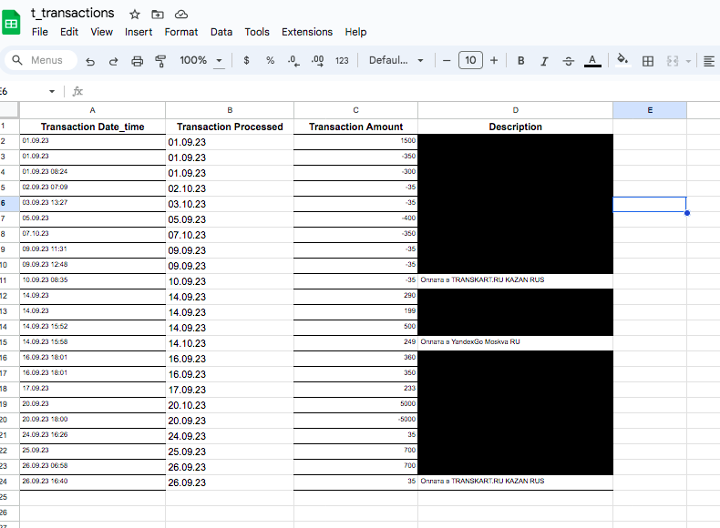

# Personal Expenses (Dashboard)

## Preparation
a) You must have an .csv file with expenses listed. Usually, you can download it from your online bank account (either in .csv format or in .pdf --> convert to .csv). See and example, below:

b) You can access the file with the transactions in Google Sheets (upload it there) or add to the application/code root folder. If you decide to go with Google Sheets, you need to connect to it with Google API. 
In doing so, please, follow the steps:
- create a project in GCfDevelopers
- Enable API for GDrive and GSheets
- Create API Keys (GCD gives a .json file)
- move .json file to the PyProject directory and RENAME it to  "service_account.json"!
- do not forget to share (as any other file) the spreadsheet file (bank transactions) in Google Sheets with the "client_email" indicated in service_account.json -

## How it works in the end:

## What were applied: 
Pandas, Numpy, Panel, HVPlot, Holoview

